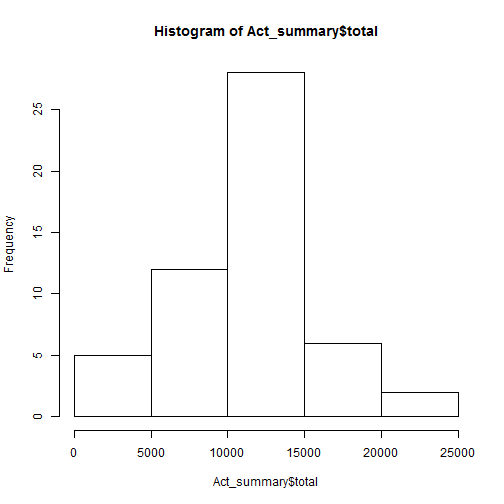
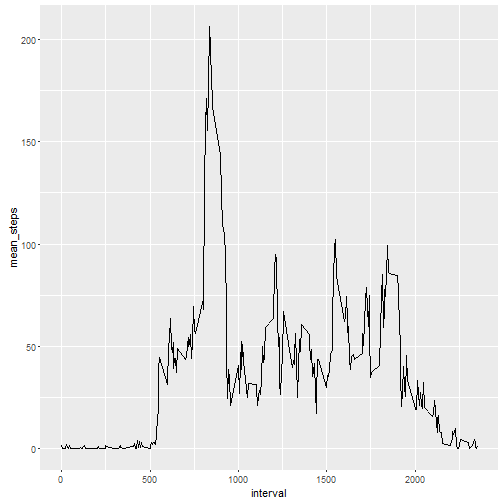
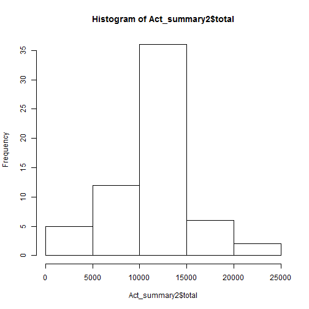
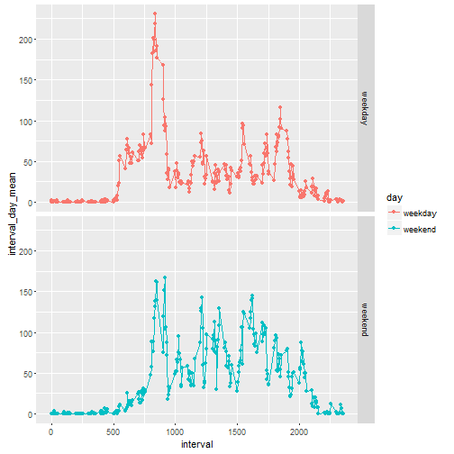

#Loading and preprocessing the data

Lets Load the required packages - ggplor and plyr

```r
require(ggplot2)
require(plyr)
```

Let's download and unzip the dataset from: https://d396qusza40orc.cloudfront.net/repdata%2Fdata%2Factivity.zip and save it as activity.zip 


```r
setwd("~")
download.file("https://d396qusza40orc.cloudfront.net/repdata%2Fdata%2Factivity.zip","~/activity.zip")
unzip(zipfile = "activity.zip",exdir = "~/activity")
setwd("~/activity/")
```

Now that the file has been downloaded let's look at the content extracted


```r
dir()
```

```
## [1] "activity.csv"      "activity.zip"      "doc"              
## [4] "figure"            "instructions_fig"  "PA1_template.html"
## [7] "PA1_template.Rmd"  "README.md"
```

We see that a file name activity.csv was extracted. Lets read this into a vaiable named "activty"


```r
activity <- read.csv("activity.csv")
```

Now lets look at the contents of the activity variable

```r
str(activity)
```

```
## 'data.frame':	17568 obs. of  3 variables:
##  $ steps   : int  NA NA NA NA NA NA NA NA NA NA ...
##  $ date    : Factor w/ 61 levels "2012-10-01","2012-10-02",..: 1 1 1 1 1 1 1 1 1 1 ...
##  $ interval: int  0 5 10 15 20 25 30 35 40 45 ...
```

```r
head(activity)
```

```
##   steps       date interval
## 1    NA 2012-10-01        0
## 2    NA 2012-10-01        5
## 3    NA 2012-10-01       10
## 4    NA 2012-10-01       15
## 5    NA 2012-10-01       20
## 6    NA 2012-10-01       25
```

Notice how the date column is a factor, lets change it to date format


```r
activity$date <- as.Date(as.character(activity$date),"%Y-%m-%d")
str(activity)
```

```
## 'data.frame':	17568 obs. of  3 variables:
##  $ steps   : int  NA NA NA NA NA NA NA NA NA NA ...
##  $ date    : Date, format: "2012-10-01" "2012-10-01" ...
##  $ interval: int  0 5 10 15 20 25 30 35 40 45 ...
```

#Mean total number of steps taken per day
Lets summarize the activity data set to show mean and median for each day


```r
Act_summary <- ddply(activity, "date", summarize, total=sum(steps))
```

Lets look at a histogram of the Act_summary, this will show us the most frequent total steps in a day for the two months.


```r
hist(Act_summary$total)
```



Mean steps per day


```r
mean(Act_summary$total, na.rm = TRUE)
```

```
## [1] 10766.19
```

Median of total steps per day for the entire period


```r
median(Act_summary$total, na.rm=TRUE)
```

```
## [1] 10765
```

#Average daily Pattern

Lets see which time of the day is most popular for walking. Lets summarize the data based 
on inerval instead of the date.


```r
Act_interval <- ddply(activity, "interval", summarize, mean_steps=mean(steps, na.rm=TRUE))
```

Lets plot the mean steps during the time interval of the day as a line graph


```r
qplot(x=interval, y=mean_steps,data=Act_interval, geom = c("line"))
```



Most popular interval of the day for the given period:


```r
Act_interval[Act_interval$mean_steps == max(Act_interval$mean_steps),]
```

```
##     interval mean_steps
## 104      835   206.1698
```

#Imputing Missing Values

Calculating the percentage of missing values


```r
na_activity <- activity[,1]
na_activity_logical <- is.na(na_activity)
na_activity[na_activity_logical]=1
na_activity[!na_activity_logical]=0
mean(na_activity)
```

```
## [1] 0.1311475
```

```r
sum(na_activity)
```

```
## [1] 2304
```

i.e. there are 2304 rows with missing data making it roughtly 13.11% of the data.

Lets replace the NA's in the steps to be the mean of the interval


```r
updated_activity <- join(activity, Act_interval, by="interval")
head(updated_activity)
```

```
##   steps       date interval mean_steps
## 1    NA 2012-10-01        0  1.7169811
## 2    NA 2012-10-01        5  0.3396226
## 3    NA 2012-10-01       10  0.1320755
## 4    NA 2012-10-01       15  0.1509434
## 5    NA 2012-10-01       20  0.0754717
## 6    NA 2012-10-01       25  2.0943396
```

Let's update the new data frame to have the mean steps where it has NA and preserve the data for the intervals where the steps were not NA


```r
updated_activity$steps[is.na(updated_activity$steps)]=updated_activity$mean_steps[is.na(updated_activity$steps)]
head(updated_activity)
```

```
##       steps       date interval mean_steps
## 1 1.7169811 2012-10-01        0  1.7169811
## 2 0.3396226 2012-10-01        5  0.3396226
## 3 0.1320755 2012-10-01       10  0.1320755
## 4 0.1509434 2012-10-01       15  0.1509434
## 5 0.0754717 2012-10-01       20  0.0754717
## 6 2.0943396 2012-10-01       25  2.0943396
```

See how the Steps on the first few rows is equal to the mean steps for that interval as compared to last time where it was NA.

Now lets summarize the data again to see the impact ot replacing NA's
We start by created another data froma with total steps per day.


```r
Act_summary2 <- ddply(updated_activity, "date", summarize, total=sum(steps))
```

Lets look at a histogram of this new variable we called Act_summary2.


```r
hist(Act_summary2$total)
```



Mean steps per day


```r
mean(Act_summary2$total, na.rm=TRUE)
```

```
## [1] 10766.19
```

The mean comes out to be the same as before.

Median of total steps per day for the entire period


```r
median(Act_summary2$total, na.rm=TRUE)
```

```
## [1] 10766.19
```

The median has shifted by 1,19 towards mean.


#Weekday Vs Weekend

Lets assign whether the data is from a weekend or a weekday:


```r
Act_by_day<-updated_activity
#Act_by_day <- ddply(Act_by_day, c("date"), summarize, steps=sum(steps))
Act_by_day$day[weekdays(Act_by_day$date)!="Saturday" & weekdays(Act_by_day$date) !="Sunday"]="weekday"
Act_by_day$day[weekdays(Act_by_day$date)=="Saturday" | weekdays(Act_by_day$date) =="Sunday"]="weekend"

head(Act_by_day, 10)
```

```
##        steps       date interval mean_steps     day
## 1  1.7169811 2012-10-01        0  1.7169811 weekday
## 2  0.3396226 2012-10-01        5  0.3396226 weekday
## 3  0.1320755 2012-10-01       10  0.1320755 weekday
## 4  0.1509434 2012-10-01       15  0.1509434 weekday
## 5  0.0754717 2012-10-01       20  0.0754717 weekday
## 6  2.0943396 2012-10-01       25  2.0943396 weekday
## 7  0.5283019 2012-10-01       30  0.5283019 weekday
## 8  0.8679245 2012-10-01       35  0.8679245 weekday
## 9  0.0000000 2012-10-01       40  0.0000000 weekday
## 10 1.4716981 2012-10-01       45  1.4716981 weekday
```

Lets finally summarize this data based on weekday/weekend.


```r
Act_by_day$day <- as.factor(Act_by_day$day)
Week_day_end <- ddply(Act_by_day, c("interval","day"), summarize, interval_day_mean=mean(steps))

qplot(x=interval, y=interval_day_mean,data=Week_day_end,facets=day~.,geom=c("point","line"),col=day)
```



Looking at the graph, we can see that the subject is active for more time during the weekend when compared to the weekdays where the distribution is more skewed towards the start of the day only while on the weekends it shows that the distribution is more even al day long dipicting that the subject walks around more frequently during the weekends.


